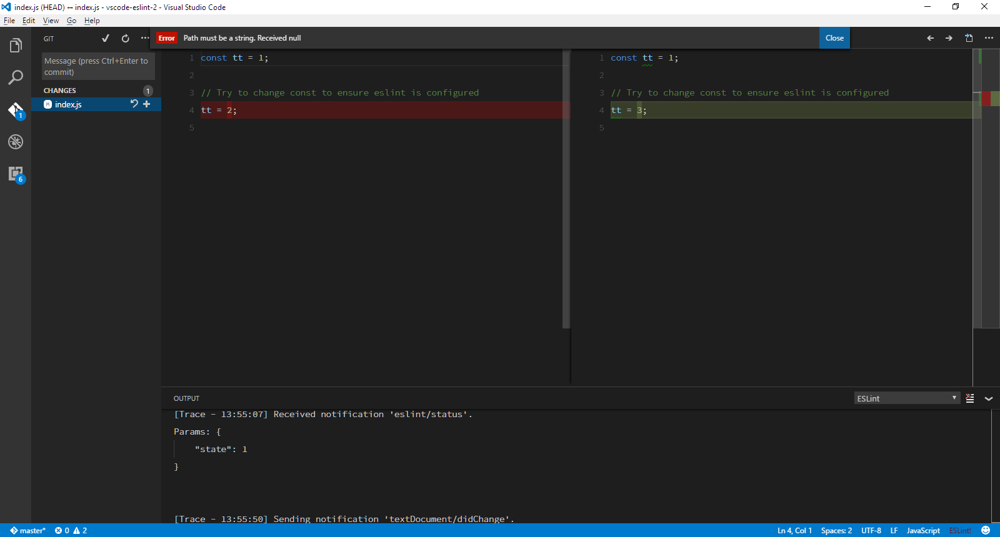

# Test ESLint nodePath

Run `npm install` to install The local eslint node package which is an outdated version of 1.10.3 for test purposes.

---

The "eslint.nodePath" setting in .vscode/settings.json is set to "D:\\temp\\node_modules".

The eslint package stored in "D:\\temp\\node_modules" is version 3.10.2.

Therefore, I would expect the ESLint extension to ignore the locally installed eslint package and use eslint version 3.10.2 accordingly.

---

However, when I make a change to index.js and click on it from Git View to view the diff I get the error:

This implies that the extension is still using the local eslint package(1.10.3).

---

If I uninstall the local package, I will not see the error message. This implies either the global NODE_PATH setting is being used or that which is set in .vscode/settings.json.
